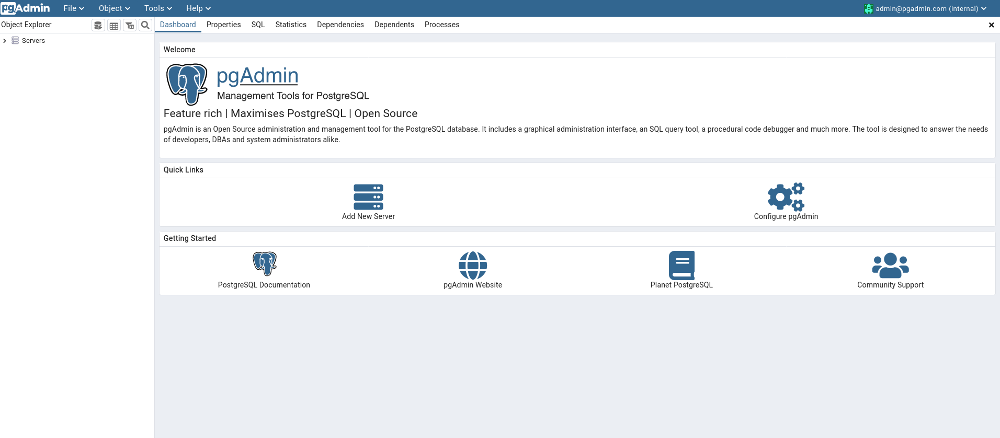
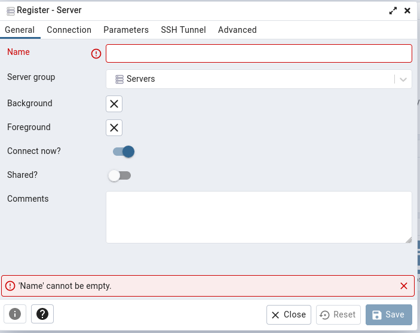

# Simple docker-compose configuration, for Postgres
1. Install Docker and Docker Compose

- [Docker](https://docs.docker.com/engine/install/)
- [Docker Compose](https://docs.docker.com/compose/install/)

2. Clone Repository
3. Run Docker Compose

```bash
docker-compose up
```

##### Now you can fully access and work with Postgres

```bash
docker-compose exec postgres bash
```

```bash
psql demo
```

##### Where demo is the database, what was defined in docker-compose.yml

### Using pgAdmin

```
localhost:15432
```


The port number is based on the mapping we configured under pgadmin service.
Then key-in the email and password configured using the environment variable:
```PGADMIN_DEFAULT_EMAIL``` and ```PGADMIN_DEFAULT_PASSWORD```.

##### Setup database

Click Add New Server under Quick Links.


Enter Name under General. The value can be anything.


Enter Host name/address, Username and Password under Connection.

    For Host name/address, the value is the Docker Compose database service name, in our case is postgres.
    For Username, the value is the environment variable POSTGRES_USER.
    For Password, the value is the environment variable POSTGRES_PASSWORD.

And click Save to finish create. After done, we can get access to the database from the sidebar.